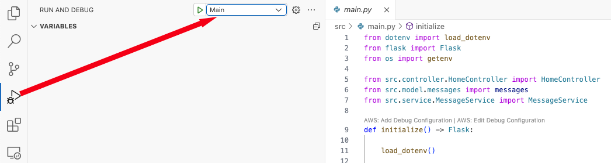

[//]: # (README.md)
[//]: # (Copyright © 2024 Clean Coders Collaborative. All rights reserved.)
[//]: #


# Mastermind

If you stumbled across this repository without coming through the Clean Coders Collaberative
you are more than welcome to explore this!
In a nutshell Clean Coders Collaborative is a group that studies building better software.
If you want to learn more, visit the Meetup page at https://www.meetup.com/clean-mobile-code/.

## Overview

Implementing the Mastermind game will allow plenty of opportunities to discuss and experiment with TDD, Agile, and development principles
and patterns.
The environment has been chosen to focus on those topics, and not create a high learning curve to participate:

1. The game because it offers multiple opportunities for discussion.
1. Python is chosen because of the common C-like syntax, the prevalence
of use, and that both object-oriented and functional programming topcis may be addressed.
1. Visual Studio Code will be the IDE, because of the price tag, the available extensions, and it is the interface for GitHub Codespaces.
1. The project is configured in such a way as to be developed using a local Python installation or in a Codespace at GitHub if
you prefer not to (or cannot) install Python on your computer.

This repository will be updated with new program features as the project progresses through the Clean Coders Collaborative meetups
and the code is accepted by the participants.
See the [*Git Notes*](#git-notes) section below for instructions on cloning the repository, making pull requests, and updating
your GitHub and local copies to stay in sync with the meetup.

## Process

### Prior to the first meetup

1. Follow the [*Configuration*](#configuration) instructions to use either your local computer or a GitHub Codespace for development.
1. Review the rules for Mastermind: https://en.wikipedia.org/wiki/Mastermind_(board_game)

### At the meetups

1. The group will be led by *champions* for the project.
The champions will pick the topic of discussion, and the group will develop code and talk
about making it better.
1. Gather requirements and define priorities.
1. Use TDD to start the project.
Agile will be incorported; if you are a Scrum connoisseur each meetup is a sprint, complete with a planning meeting at the beginning
and a retrospective at the end.
Remember that Agile, and even TDD, are not the focus of this project.
The focus is *Clean Code*.
1. If different teams work on aspects of the code, use separate branches for the work, push to your own
repository, and issue pull requests to
merge with the Clean Coders Collaborative repository.

## Configuration

As mentioned in the overview above, there are two options for the development environment:

* [Option 1: Local development environment (preferred)](#option-1-local-development-environment-preferred)
* [Option 2: Develop in a GitHub Codespace](#option-2-develop-in-a-github-codespace)

### Option 1: Local development environment (preferred)

1. At a terminal window or command prompt (all systems) check to see if you have Python 3.
$ is the command prompt, and there are three possible commands to check:
    ```
    $ python --version
    $ python3 --version
    $ py --version
    ```
1. Check for *git*:
    ```
    $ git --version
    ```

#### Apple MacOS

1. Install Python 3 if you do not have it; three options:
    1. Install with Homebrew ($ is the command prompt): <sup>[Install Homebrew](#homebrew)</sup>
        ```
        $ brew install python
        ```
    1. Download and install from python.org: https://docs.python.org/3/using/mac.html
    1. Download and install from Anaconda.com: https://www.anaconda.com/download
1. Install git if you do not have it; two options:
    1. Install with Homebrew:
        ```
        $ brew install git
        ```
    1. Download and install from git-scm: https://git-scm.com/downloads/mac
1. Install Visual Studio Code if you do not have it; two options:
    1. Install with Homebrew:
        ```
        $ brew install --cask visual-studio-code
        ```
    1. Download and install from Microsoft: https://code.visualstudio.com/
1. Continue with [*All Platforms*](#all-platforms) below.

#### Microsoft Windows

1. Install Python 3 if you do not have it; three possible options:
    1. Install with Chocolatey ($ is the command prompt):  <sup>[Install Chocolatey](#chocolatey)</sup>
        ```
        $ choco install -y python3
        ```
    1. Download and install from python.org: https://docs.python.org/3/using/windows.html
    1. Download and install from Anaconda.com: https://www.anaconda.com/download
1. Install Visual Studio Code, if necessary:
    1. Install with Homebrew:
        ```
        $ brew install --cask visual-studio-code
        ```
    1. Download and install from Microsoft: https://code.visualstudio.com/
1. Continue with [*All Platforms*](#all-platforms) below.

#### Linux

1. Install Python 3 if you do not have it:
    ```
    $ sudo apt update; sudo apt install python3          # Debian Linux (Ubuntu, etc.)
    $ sudo yum check-update; sudo yum install python3    # RHEL (Red Hat, Centos, etc.)
    ```
1. Install Visual Studio Code, if necessary:
    1. Install with Homebrew:
        ```
        $ brew install --cask visual-studio-code
        ```
    1. Download and install from Microsoft: https://code.visualstudio.com/
1. Continue with [*All Platforms*](#all-platforms) below.

#### All Platforms

1. We recommend that you set up an SSH Key at GitHub to pull and push repository changes,
that will be much easier than using a password.
See the [Git Notes](#git-notes) section for details.
1. Install the necessary extensions to the VSCode environment:
    1. Click the extensions icon on the toolbar. 
    2. Add (if not already installed) Microsoft Python, Microsoft Python Debugger, Microsoft Live Share, and
    Ritwik Dey Liver Server:
    
1. Fork this repository to your own GitHub account:
    
1. Clone your copy to your local machine using git at the command prompt/terminal:
    ```
    $ cd <your projects directory>
    $ git clone <your repository path>
    ```
1. Open VSCode and select the repository folder you just cloned.
1. Open a terminal window.
1. Create a local Python virtual environment (substitute python3 or py for python depending on installation):
    ```
    $ python -m venv .venv
    $ . .venv/bin/activate        # MacOS or Linux
    $ .venv\Scripts\activate      # Windows
    ```
1. Use *pip* to install the Python modules necessary for this project:
    ```
    $ pyrhon -m pip install coverage mock flask python-dotenv 
    ```
1. On the toolbar click the run-debug icon 
1. At the top right of the panel select and launch the configuration *Hello, World!*:

    

1. In the terminal panel that opened look for the output line beginning with "Application starting on...":
    ```
    Application starting on http://localhost:3000/
    ```
1. Cmd/ctrl-click the URL (cmd on a Mac, ctrl on Windows or Linux) to launch the browser page.
1. Verify the application works and shows the logo and message:

    

1. Close the browser page.
1. Find the debug controls and click the red-bordered stop button to terminate the application: 
1. Congratulations, everything is set to start!

## Option 2: Develop in a GitHub Codespace

GitHub Codespaces are Docker containers running on servers at GitHub.
When you launch a Codespace 

1. Fork this repository to your own GitHub account:
    
1. Create your own branch in your copy of the respository.
You should name the branch as \<your GitHub username\>-\<main\>.
1. In the new repository, click the Code button, select the Codespaces tab, and create a new Codespace
on *your development branch*.
1. A new Docker container will be created at GitHub with a random name like "solid-sniffle-6pp459r6j53qg6".
1. A copy of VSCode will be launched as a single-page application in your browser, and will be
connected to the Docker container where the project will be developed.
1. Wait for the last command to run in the terminal panel at the screen bottom (your
username will be different):
    ```
    . ./.devcontainer/postAttachCommand.sh
    @jmussman ➜ /workspaces/mastermind (main) $ . ./.devcontainer/postAttachCommand.sh
    ```
1. On the toolbar click the run-debug icon 
1. At the top right of the panel select and launch the configuration *Hello, World!*:

    

1. In the terminal panel that opened look for the output line beginning with "Application starting on...".
It will have a funny name (different from this one):
    ```
    Application starting on https://solid-sniffle-6pp459r6j53qg6-3000.app.github.dev/
    ```
1. Cmd/ctrl-click the URL (cmd on a Mac, ctrl on Windows or Linux) to launch the browser page.
You may get a message about connecting to a port on another user's Codespace, that happens because
third-party cookies are not enabled.
Ignore it, and move on.
1. Verify the application works and shows the logo and message:

    

1. Close the browser page.
1. Find the debug controls and click the red-bordered stop button to terminate the application: 
1. Congratulations, everything is set to start!

### Notes:

* The container is always launched on a specific code branch.
If you are creating branches for specific backlog tasks, make sure you pick the right branch when launching the Codespace.
* Codespaces are not infinite; you can only have so many, and even fewer running simultanesouly.
* Codespaces will self-destruct after too many days idle.
* Codespaces work on their own clone of the branch.
Make sure you save and commit changes to the repository in your GitHub account if you want to keep your work before
the Codespace is destroyed.
* The limits on free Codespace use may be found here: https://docs.github.com/en/billing/managing-billing-for-your-products/managing-billing-for-github-codespaces/about-billing-for-github-codespaces#monthly-included-storage-and-core-hours-for-personal-accounts.

## Git Notes

There are many ways to use git, and just as many arguments about what is the best way to manage a development project.
Some folks argue that there should only be one branch in a shared repository and everybody pushes their
commits to that branch.
But, if there are multiple teams AND/OR a requirement for pull requests and
formal code reviews (strongly encouraged) a single branch will not work.

In order to perform a pull request and the associated code review, the code either needs to be on a separate branch
in the same repository in a completely different repository.
For Mastermind this will have to be in your own repository because we are not granting write access to
the source repository.
Teams are free to share such a repository while they work and do with it as they please.

Your repository should have a development branch (it could be named something else).
You and any other team members may use this as a single branch to push commits to.
Or, as many projects provide you can use separate feature branches for individuals, pairs, and mobs to do their work on.
Remember, you will work on the branch on your local computer, and push commits to the remote
repository frequently so other members of the team can see that work and merge it with their local copies.
Passing unit tests before a commit and a push is desirable.


In the real world feature branches names are often composed from the issue tracking code for the feature
and a descriptive task name.
If you are using a single branch, name it after your team.
The name provides accountability for what was done in the Git history of the main repository
when pull requests are merged.

When you are working on a specific feature, try to limit
making any changes to other areas of the code the feature may depend on.
This will minimize merge-conflicts during pull requests.
It is better if you can ask whoever is responsible for that area to make the
changes for you on their copy and then you can merge that with your branch.


In the real world, the end of the main branch should contain the last stable release
of the product, and previous merge points are the previous stable releases.
If the main branch is constantly being updated and undergoing testing as some
teams try to do, it is harder to work backwards to find the last stable release.

It is recommended to do integration testing and exceptance testing on a branch
devoted to that purpose.
The testing branch could be a branch in the main repository, a branch pulled from a second
repository, or very likely a combination of both when forked repositories are necessary for teams.
When tests pass and a release is set, merge that to the main branch to keep track of it.

### SSH Keys

SSH uses a private-public key-pair to both establish the authenticity of one party and start encrypted communications.
The key-pair of assymetric encryption provides that data encrypted with either key may only be decrypted with the other.
The public key will be registered with the GitHub account.

When a connection is started GitHub sends a challenge message that must be returned encrypted with the user's private key.
If the message decrypted with the public key is the same, then it must be the user (or someone else who has gained access to the private key).

The private key should be protected, and is stored in the .ssh folder under the user's home directory.
The *git* command will automatically try to use the private key it finds there to establish the connection,
so this is tremendously both easier and more secure than entering a password each time.

To set this up a private-public key-pair must be established, and the public key registered with the GitHub account.
See the documentation below in [*Git Resources*](#git-resources).

### Git Resources

* Git-SCM instructions to create an SSH key-pair: https://git-scm.com/book/en/v2/Git-on-the-Server-Generating-Your-SSH-Public-Key
* Adding an SSH key to your GitHub Account: https://docs.github.com/en/authentication/connecting-to-github-with-ssh/adding-a-new-ssh-key-to-your-github-account
* GitHub recommendations on flow: https://docs.github.com/en/get-started/using-github/github-flow
* Atlassian documentation for *Feature Branch Workflow, Gitflow Workflow,* and *Forking Workflow*: https://www.atlassian.com/git/tutorials/comparing-workflows.

## Footnotes

### Homebrew

Homebrew is a popular application and package manager for Apple MacOS.
Installation instructions are located here: https://brew.sh

### Chocolatey

Chocolatey is an application and package manager for Microsoft Windows.
Installation instructions are located here: https://chocolatey.org/install

## License

The code is licensed under the MIT license. You may use and modify all or part of it as you choose, as long as attribution to the source is provided per the license. See the details in the [license file](./LICENSE.md) or at the [Open Source Initiative](https://opensource.org/licenses/MIT).


<hr>
Copyright © 2024 Clean Coders Collaborative. All rights reserved.